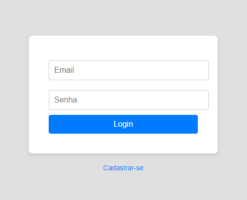
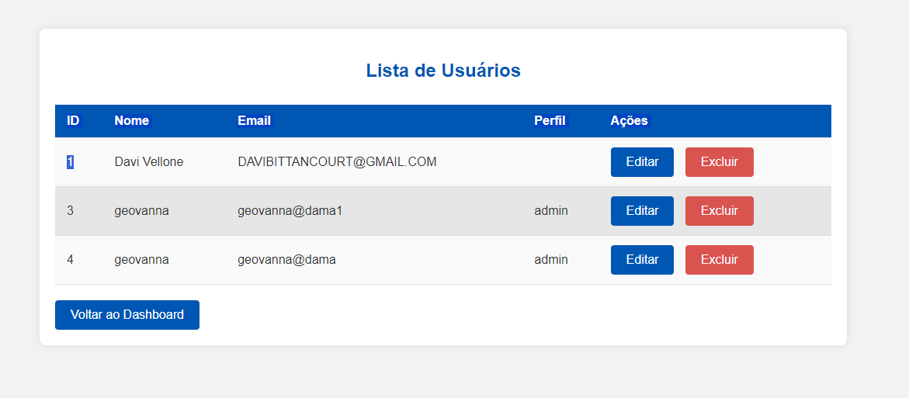

# Cadlog-system

## Página de Login



Este projeto contém uma página de login simples, estilizada com CSS para ter um visual formal e profissional. A página foi projetada para ser fácil de usar e totalmente responsiva, com um formulário de login centralizado e um link de cadastro destacado.

## Funcionalidades 

- Formulário de login que aceita email e senha.

- Validação básica dos campos (email e senha são obrigatórios).

- Estilo formal com uma interface limpa e agradável.

- Design responsivo e centralizado, adaptando-se bem a diferentes tamanhos de tela.

- Link de cadastro destacado, posicionado logo abaixo do formulário de login.

## Estrutura do Projeto

O projeto consiste em um arquivo HTML que define a estrutura e a estilização da página de login. A página é composta por um formulário com dois campos de entrada e um botão de envio, além de um link de redirecionamento para a página de cadastro.

## Estrutura do HTML

- Cabeçalho (<head>):

- Define o conjunto de caracteres como UTF-8.

- Utiliza meta tag viewport para garantir que o design seja responsivo em dispositivos móveis.

- Título da página: "Entrar".

- Corpo (<body>):

- Contém um formulário de login (<form>) com os seguintes elementos:
- Campo de email (<input type="email">).
- Campo de senha (<input type="password">).
- Botão de envio (<button type="submit">Login</button>).
- Um link para a página de cadastro (<a href="index.php?action=register">Cadastrar-se</a>).

 ## Página de registro 

 

 Este projeto é uma simples página web de cadastro de usuário. A interface permite ao usuário inserir seus dados (nome, e-mail, senha) e escolher um perfil (Admin, Gestor ou Colaborador). 

 ## Funcionalidades 

- Campo Nome: Um campo de texto obrigatório para o usuário inserir seu nome.

- Campo E-mail: Um campo de e-mail obrigatório que valida se o formato do e-mail está correto.

- Campo Senha: Um campo de senha obrigatório para que o usuário insira sua senha.

- Seleção de Perfil: Um dropdown que permite ao usuário selecionar um dos perfis disponíveis (Admin, Gestor ou Colaborador).

- Botão de Cadastro: Um botão para enviar o formulário. Atualmente, o botão não está vinculado a nenhuma ação de back-end.

- Link para Login: Um link que, quando implementado, levará o usuário de volta à página de login.

## Estrutura do HTML 

- Define o documento como HTML5:
```

<!DOCTYPE html>

```

- Define o idioma da página como português (Brasil):
```

<html lang="pt-br">: 

```

- Contém as meta tags (como charset e viewport) e o título da página:

```

<head>: 

```

- Contém o conteúdo visível da página:
```

<body>:

```
- Uma div centralizada contendo:
- Um título **h2** com o texto "Cadastro de Usuário".
- Um formulário **form** que contém campos para nome, e-mail, senha e perfil do usuário, além de um botão de envio.
- Um link **a** para voltar à página de login (a ser implementado).

## Campos de Formulário

- Nome:
```

 <input type="text" name="nome" id="nome" required>

 ```

- E-mail:
```

 <input type="email" name="email" id="email" required>


```
- Senha: 
```

<input type="password" name="senha" id="senha" required>

```

- Perfil: 
```

<select name="perfil" id="perfil"> com opções "Admin", "Gestor" e "Colaborador".

```

## Requisitos de validação 

- Todos os campos são obrigatórios (definidos pela propriedade required).

- O campo de e-mail faz validação automática para garantir que um formato válido seja inserido (e.g., exemplo@dominio.com).

## Lista de Usuários

Esta página consiste em uma aplicação web de listagem de usuários com controle de acesso baseado em perfis de usuário. A interface apresenta uma tabela com dados de usuários, onde as ações disponíveis (editar e excluir) variam conforme o perfil do usuário logado.

 

### Funcionalidades Principais 

- Listagem de Usuários: Exibe uma tabela com os usuários, contendo colunas para ID, Nome, Email, Perfil e Ações.

- Controle de Acesso: Usuários podem ter diferentes perfis, como admin ou gestor, e as permissões variam de acordo com o perfil:
- Admin: Pode visualizar, editar e excluir usuários.
- Gestor: Pode visualizar e editar usuários, mas não excluir.
- Outros: Podem visualizar a lista de usuários, mas não realizar nenhuma ação (editar ou excluir).
- Interface Responsiva: Layout ajustável para dispositivos móveis.
- Feedback Visual: Quando o cursor passa sobre as linhas da tabela, a linha muda de cor. Botões possuem efeito hover para aprimorar a experiência do usuário.

### Estrutura do Projeto 

#### PHP: Gerenciamento de Sessões e Controle de acesso

O código PHP gerencia o controle de acesso dos usuários. As permissões são baseadas na variável de sessão $_SESSION['perfil'], que determina as ações disponíveis para cada usuário:

- Se a sessão não estiver iniciada ou o perfil não for definido, o sistema bloqueia o acesso e exibe uma mensagem de erro.
- Para admin e gestor, o sistema permite editar informações de usuários, enquanto somente o admin pode excluir.

### HTML: Estrutura da Página

A página é composta por uma tabela (<table>) onde os dados dos usuários são listados, juntamente com botões de ação (editar e excluir). A estrutura principal contém:

- Um cabeçalho (<h2>) com o título da página.
- Uma tabela onde cada linha representa um usuário.
- Links de ação (Editar e Excluir), que aparecem ou não dependendo do perfil do usuário logado.

### CSS: Estilização e Responsividade

O estilo foi desenvolvido para criar uma interface limpa e moderna, utilizando tons de azul e cinza. O layout é responsivo, adaptando-se bem a diferentes tamanhos de tela, especialmente dispositivos móveis.

- Tabela Estilizada: Linhas alternam cores em tons de cinza, e a cor muda para azul claro ao passar o mouse sobre uma linha.
- Botões: Estilizados em azul escuro com texto branco. O botão de exclusão é vermelho para indicar a gravidade da ação. Todos os botões possuem efeitos de transição para suavizar as interações do usuário.
- Responsividade: O layout foi projetado para se adaptar a diferentes resoluções de tela. Em dispositivos menores, os espaçamentos e tamanhos de fonte são ajustados para manter a legibilidade.


## Dashboard 

Este projeto é uma interface de dashboard simples com PHP e HTML para exibir diferentes áreas de acesso com base no perfil do usuário. O dashboard diferencia permissões de acesso entre Admin, Gestor e Colaborador, e possui estilos básicos utilizando CSS com cores azul e cinza.

### Funcionalidades 

- Exibe uma mensagem de boas-vindas personalizada com base no perfil do usuário.
- Diferencia permissões:
- Admin: Pode gerenciar usuários com as permissões de edição e exclusão.
- Gestor: Pode gerenciar usuários apenas com a permissão de edição.
- Colaborador: Apenas área de visualização.
- Link para logout.

### Estrutura do código

O projeto possui um código HTML e PHP, além de uma seção de estilo em CSS no próprio arquivo HTML para estilização básica.

#### Código PHP e HTML

- O código HTML exibe mensagens e botões de gerenciamento, variando o conteúdo conforme o perfil do usuário.

- O perfil do usuário é identificado pela variável $_SESSION['perfil'], que deve estar definida previamente no sistema de login para diferenciar cada tipo de usuário.


## Edição e exclusão de usuários 

Este documento descreve a implementação e estilização das funcionalidades de edição e exclusão de usuários na aplicação. Esses recursos são essenciais para permitir que administradores ou usuários com permissões adequadas gerenciem contas.

### Classes utilizadas 


## Tecnologias utilizadas 

- Vs Code 
- Xampp 
- Chat GPT 
- PHP
- SQL
- CSS
