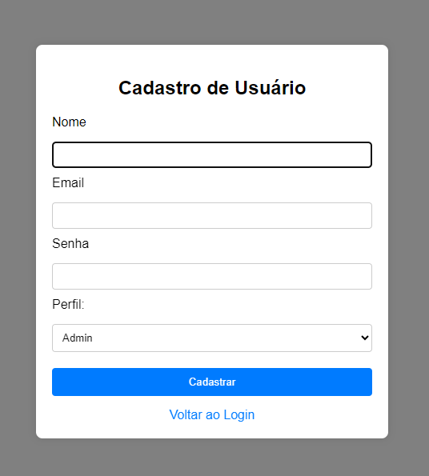

# Cadlog-system

## Página de Login

[tela de login](imagens/login.png)

Este projeto contém uma página de login simples, estilizada com CSS para ter um visual formal e profissional. A página foi projetada para ser fácil de usar e totalmente responsiva, com um formulário de login centralizado e um link de cadastro destacado.

## Funcionalidades 

- Formulário de login que aceita email e senha.

- Validação básica dos campos (email e senha são obrigatórios).

- Estilo formal com uma interface limpa e agradável.

- Design responsivo e centralizado, adaptando-se bem a diferentes tamanhos de tela.

- Link de cadastro destacado, posicionado logo abaixo do formulário de login.

## Estrutura do Projeto

O projeto consiste em um arquivo HTML que define a estrutura e a estilização da página de login. A página é composta por um formulário com dois campos de entrada e um botão de envio, além de um link de redirecionamento para a página de cadastro.

## Estrutura do HTML

- Cabeçalho (<head>):

- Define o conjunto de caracteres como UTF-8.

- Utiliza meta tag viewport para garantir que o design seja responsivo em dispositivos móveis.

- Título da página: "Entrar".

- Corpo (<body>):

- Contém um formulário de login (<form>) com os seguintes elementos:
- Campo de email (<input type="email">).
- Campo de senha (<input type="password">).
- Botão de envio (<button type="submit">Login</button>).
- Um link para a página de cadastro (<a href="index.php?action=register">Cadastrar-se</a>).

 ## Página de registro 

 

 Este projeto é uma simples página web de cadastro de usuário. A interface permite ao usuário inserir seus dados (nome, e-mail, senha) e escolher um perfil (Admin, Gestor ou Colaborador). 

 ## Funcionalidades 

- Campo Nome: Um campo de texto obrigatório para o usuário inserir seu nome.

- Campo E-mail: Um campo de e-mail obrigatório que valida se o formato do e-mail está correto.

- Campo Senha: Um campo de senha obrigatório para que o usuário insira sua senha.

- Seleção de Perfil: Um dropdown que permite ao usuário selecionar um dos perfis disponíveis (Admin, Gestor ou Colaborador).

- Botão de Cadastro: Um botão para enviar o formulário. Atualmente, o botão não está vinculado a nenhuma ação de back-end.

- Link para Login: Um link que, quando implementado, levará o usuário de volta à página de login.

## Estrutura do HTML 

- <!DOCTYPE html>: Define o documento como HTML5.

- <html lang="pt-br">: Define o idioma da página como português (Brasil).

- <head>: Contém as meta tags (como charset e viewport) e o título da página.

- <body>: Contém o conteúdo visível da página.
- Uma div centralizada contendo:
- Um título <h2> com o texto "Cadastro de Usuário".
- Um formulário <form> que contém campos para nome, e-mail, senha e perfil do usuário, além de um botão de envio.
- Um link <a> para voltar à página de login (a ser implementado).

## Campos de Formulário

- Nome: <input type="text" name="nome" id="nome" required>

- E-mail: <input type="email" name="email" id="email" required>

- Senha: <input type="password" name="senha" id="senha" required>

- Perfil: <select name="perfil" id="perfil"> com opções "Admin", "Gestor" e "Colaborador".

## Requisitos de validação 

- Todos os campos são obrigatórios (definidos pela propriedade required).

- O campo de e-mail faz validação automática para garantir que um formato válido seja inserido (e.g., exemplo@dominio.com).

## Tecnologias utilizadas 

- Vs Code 
- Xampp 
- Chat GPT 
- PHP
- SQL
- CSS

